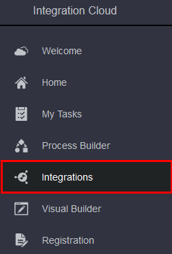
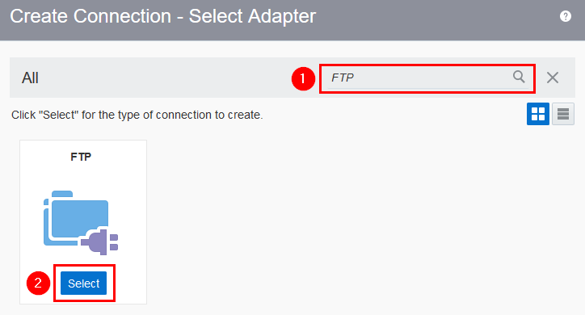

# CSH Campaign Assets 2018: ICS File Transfer

Updated: 09-Mar-2018

## Introduction

This is the second of several labs that are part of the **CSH Campaign Assets 2018: ICS File Transfer workshop**. This workshop will demonstrate how to read an opaque file from a *inbound*  directory and write the file to an *upload* directory in a scheduled orchestrated integration. 

In the first lab (100), we focused on provisioning the Oracle Integration Cloud environment and to  familiarize you with Oracle Integration Cloud. In this lab you will create the connection which allows Integration Cloud to interact with and FTP server.

***To log issues***, click here to go to the [github oracle](https://github.com/oracle/learning-library/issues/new) repository issue submission form.

## Objectives

- Configure the connection properties 
- Test the connection

# Create Connection
Connections allow Integration Cloud to interact with an application instance. A connection is required for every application instance that participates in an integration. In this lab, you will create one connection - for an FTP folder using the FTP adapter. 

  - connectivity by specifying the FTP server URL
  - Configure the security by selecting the Security Policy and credentials

## Create the FTP Connection

### **STEP 1**: Configure the connection properties

- Start **Integration Cloud** and click on **Integrations**.

        

- In the resulting **Integrations** navigation pane, click **Connections**.

        

- In the **Connection** page, click **Create**.
- Type `ftp` in the Select Adapter Search field, click **FTP** in the resulting drop-down, and then select the **FTP** adapter.

        

- Enter the following connection information in the **Create New Connection** dialog.
  - **Name**: `FTPConnection_XX` (where `XX` should be your initials)
  - **Identifier**: Auto generated (leave default)
  - **Role**: Trigger and Invoke (leave default)
  - **Description**:  `This is an FTP connection to public ftp server "speedtest.tele2.net" used by Oracle Samples.`

### **STEP 2**: Test the connection

- On the **Microservices** Board, click **Active Sprints**

      

## Create Initial Git Repository

### **STEP 3**: Create Initial Git Repository

To begin development on our Twitter feed microservices, we could start coding from scratch. However, prior to the formal kickoff of this project, you (as Bala Gupta) have already started doing some proof-of-concept development outside of the Developer Cloud Service in order to assess the feasibility of your assignment. You want to bring that existing code into the Developer Cloud Service as a starting point for your microservices. You will do that by cloning your external GIT repository into the Developer Cloud Service. Your first step will be to accept your task using the agile board.

- Drag and drop **Task1 - Create Initial GIT Repository for Twitter Feed Service** into the **In Progress** swim-lane.  

      

- Leave the defaults, and Click **OK**.

      

- Your Sprint progress will appear as shown below.

      

- In the left hand navigation panel, click **Project**

- On the right side in the **REPOSITORIES** section, click on **New Repository** to create a new Git Repository.

      

- In the New Repository wizard enter the following information and click **Create**.

    **Name:** `TwitterFeedMicroservice`

    **Description:** `Twitter Feed Microservice`

    **Initial content:** `Import existing repository`

    **Enter the URL:** `https://github.com/pcdavies/TwitterFeed.git`

      

### **STEP 17**: Create New Twitter App

To generate the unique twitter credentials for our microservices, we need to sign in to twitter and create a new application for this project, then generate access tokens for it.

- Navigate to https://apps.twitter.com. Click on the **Sign In** link.

      

- If you are already a twitter user, **Log In** using your twitter credentials. Otherwise, click on the **Sign up Now** link

      

- Once logged in, click on the **Create New App** button.

      

- **Enter the following** and Click on the **Create your Twitter application** button. When entering the Application Name, append something unique to the Name’s end. E.g. your initials or name:

  **Name:** `JavaTwitterMicroservice<UniqueName>`

  **Description:** `A Twitter Feed Microservice`

  **Website:** `https://cloud.oracle.com/acc`

  **Developer Agreement:** Click `Yes`

      

- Click on the **Keys and Access Tokens** tab.

      

- If at the bottom of the page your Tokens are not visible, click on the **Create my access tokens** button

      

- Note: If you are following **Method B**, before you start modifying code in Eclipse, you should switch to the master branch and pull from the remote repository.

- Return to Eclipse, and in the Project Explorer tab, expand **TwitterFeedMicroservices.git > src/main/config** and double click on **twitter-auth.json** to load the source.

 that deployment is successful before continuing.

- If you’re following **Method B**, now that you’ve enabled this new feature to access the live twitter feed, you can follow the previous steps used in this document to commit the code to the cloud. That will trigger an automatic build and cause the Application Container Cloud Service deployment to be performed by the Developer Cloud Service. Verify that deployment is successful before continuing.

- For either method, you will now be able append `/tweets` to the end of the Application Container Cloud Service URL and retrieve the Live Tweets.

- The example below shows the live tweets returned, once the application is re-deployed.

    

