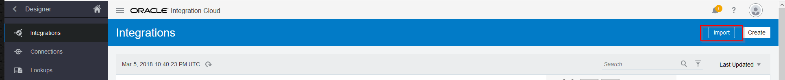
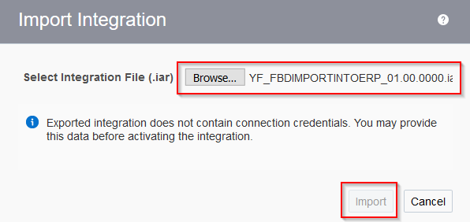
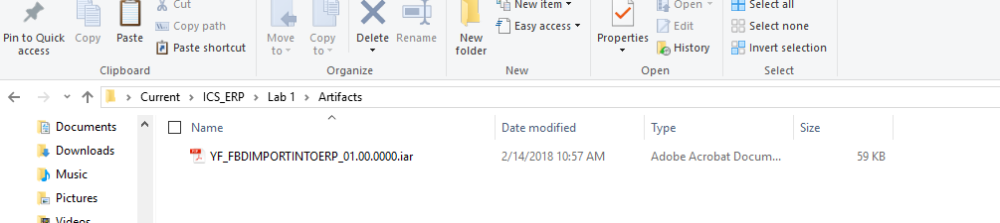
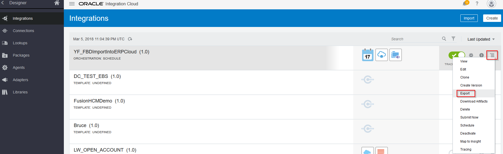
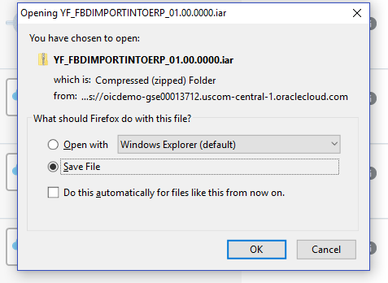

# Lab 500 - Ready to go - Integration

Updated: 03-09-18

## Introduction

In this lab you will be running the already built integration into ICS and see how it works.

The integration which is already created are under the folder named Artifacts given by instructor. This contains an .IAR file which is a zipped version of integration.

**To log issues**, click here to go to the [github oracle](https://github.com/oracle/learning-library/issues/new) repository issue submission form.

## Objectives

- Reuse the built integration to import or export and run and test

## Required Artifacts

- The following lab and an Oracle Public Cloud account that will be supplied by your instructor

### **STEP 1** Importing the Integration

## Import the Integration

- Go to Integration page. On top of the page you will see an import button. Click on it.

	

- It pops up a window and asks for .IAR file to be uploaded into ICS. Hit Browse and Choose the .IAR File from artifacts folder. Click on Import.

	
	

## Editing Connections

- The connectors will be imported as part of .IAR file we imported, but the connection properties such as URL, username and passwords and other policies need to be configured. So go back to connections tab. You will see the FTP and ERP connector we used for the integration. Refer to Lab 200 where we built the connections from scratch and fill in the details same as in LAB 200. Test and Save the connections.

## Activate and Test the Integration

- The integration will be still in deactivated state. Next, just like Lab 400, activate the Integration and Monitor and Login to ERP Cloud to check the files are imported and loaded without any errors.

## Exporting the Integration

- If you need to export the integration for further reuse, click on the 'Hamburger' menu next to your integration in the Integration page and rigtt click on it. You will see an option to export the Integration. Click on it and save it to location of your preference. This imports an .IAR file which you can reuse it later by importing.

	
	

- You have now completed the final lab of the ICS-ERP Developer Workshop where you learnt how to import and export the already built integration.  

- Congratulations! You should now have a much better understanding of how to work with ICS automation.
