# Trial Account Student Guide

Updated: 03-09-18

## Workshop Introduction

This Oracle OIC and ERP Cloud Integration workshop will walk you through the process of importing the file from File server to ERP Cloud using ICS integration.  During the workshop, you will get exposure to Oracle Integration Cloud Service.

- You can see a list of Lab Guides by clicking on the **Menu Icon**

    

- To log issues and view the Lab Guide source, go to the [github oracle](https://github.com/oracle/learning-library/issues/new) repository.

- All setup steps and lab replays have been posted on [youtube](https://www.youtube.com). You can **watch the videos** to gain an overview of the workshop and what's required to successfully complete the labs.

# Workshop Prerequisites

## _Acquire an Oracle Cloud Trial Account_

### **Step 1**: Getting your Trial Account

- Click on this URL [cloud.oracle.com/tryit](http://cloud.oracle.com/tryit&intcmp=DeveloperInnovation-HOL-11NOV17), and complete all the required steps to get your free Oracle Cloud Trial Account.

- You must wait to receive our account before continuing to the "**Configure Oracle Cloud Identity Information**" Section.

## _Configure Oracle Cloud Identity Information_

### **Step 2**: Record information from the welcome email and login

- During the provisioning of your account, you will receive two welcome email message. ***Note: You must wait for the 2nd email shown below***, as it contains information about the ***Traditional Account***, which is required for this workshop. If the second email does not appear within 30 minutes, please check your Junk or Promotions email folders (based on your email provider).


- For later use during the workshop labs, **record the following fields**, some of which you'll find in the email. The other **fields not found in the email** will be located shortly. This information will be ***used multiple times*** during the workshops Labs, so we recommend that you **copy the following list to a text document**, and then populate the fields as they are collected from the **Welcome Email** documented above.

```
Username:
Temporary Password (for Both Accounts):

Cloud Account Name:
Cloud Account Password:

Identity Domain Name:
Traditional Account Password:

Identity Tenant ID:
Data Center:
```

- ***(1)*** **Username**: With a trial account, this should be your email address.
- ***(2)*** **Temporary Password**: The first time you login, you will use this temporary password.
- ***(3)*** **Cloud Account Name**: This name will be used when you login  using the **Cloud Account with Identity Cloud Service**. ***Note***: When you click on Link **(5)** in the email, you will use this Cloud Account Name. This is the method by which all Oracle Services will eventually be authenticated.
- **Cloud Account Password**: You will login to your Cloud Account to set this password.
- ***(4)*** **Identity Domain Name**: This name will be used when you login with the **Traditional Cloud Services**. During this workshop, we will be use the Developer Cloud Services, which is currently a Traditional Cloud Services. ***Note***: When you click on Link **(6)** in the email, you will use this Identity Domain Name.
- **Traditional Account Password**: You will login to your Traditional Cloud Account to set this password in an upcoming step.
- **Identity Tenant ID**: We will locate this information later, but make a holding place in your notes for this field.
- **Data Center**: We'll locate this information in an upcoming step, and this fields will also be used when creating the connection between DevCS and ACCS.

### **Step 3**: Log into your Cloud Account

- Click on the link ***(5)*** **Cloud Account My Services URL** provided in the email.
- Follow the instructions to **set your password**, and then record in your notes the new password for this **Cloud Account Password** field.

- You are now have viewing the dashboard used to access all the Cloud Services managed by the Oracle Identity Cloud Services.

- Click on the **Customize Dashboard** box to add the some select services to the Dashboard.

    

- Located the **Storage Classic** Services, and click on **Show**.

    

- Back on your dashboard, Storage Classic should show up now. Lets initialize the storage replication policy if not done. Click on storage classic.

    

- A page with storage classic details will show up. Scroll down and you will see REST end point. Copy and save it for later use.

    

- Click on open service console. 

    

- Click on set policy for replication.

     

- Go back to dashboard.
    
     

- Click on 'hamburger' menu.

    

- Click on services.

    

- Go to any cloud service and Click on Java.

    

- Click on 'hambruger' menu and click on 'Cloud stack'.

    

- This opens up a new window and click on templates.

    

- Click on '+' to create a new template.

    

- This opens a new window. Fill in the details as shown.

    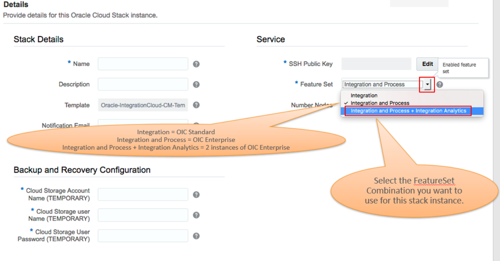
    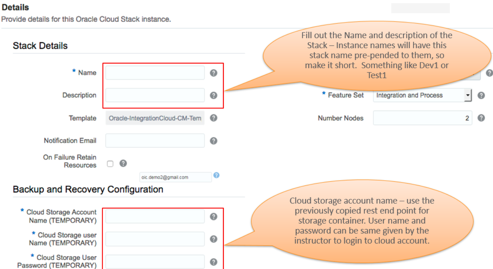

- Fill in other details as shown below and click on edit to set up ssh key.

    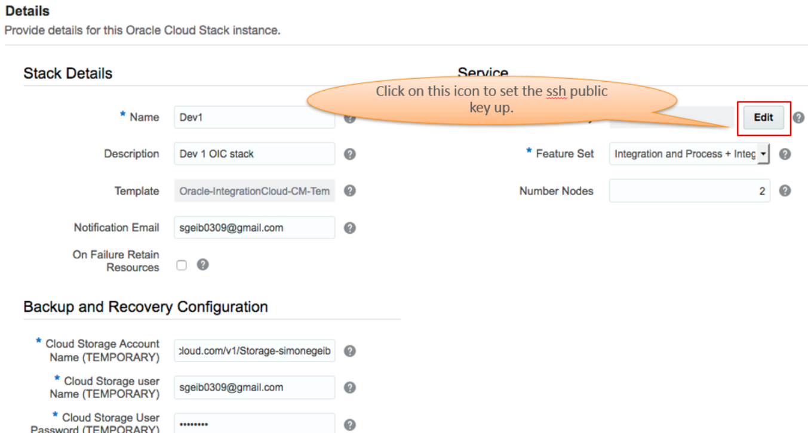

- Click on create a new key and then hit 'enter'. Click on download and save it to location of your choice. Hit done.

    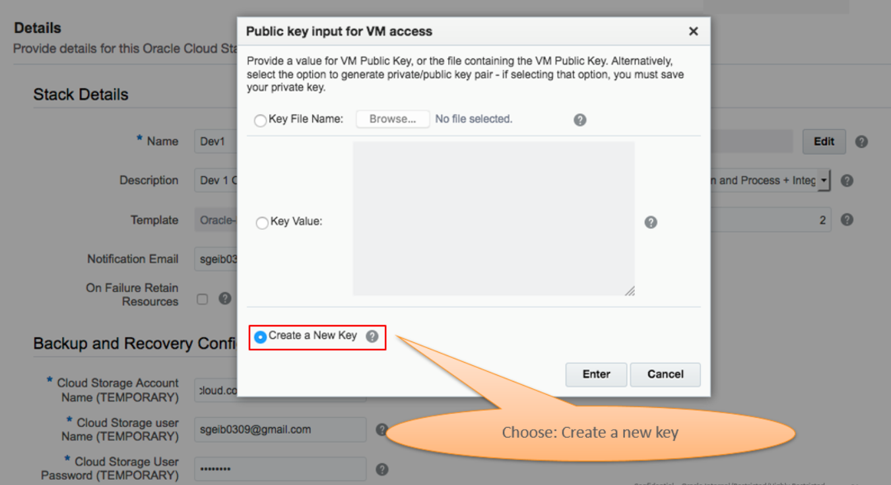
    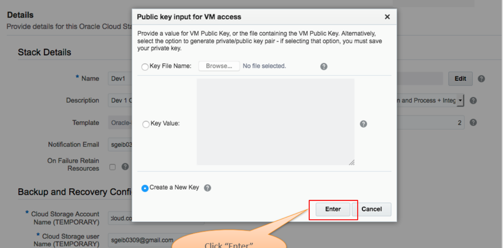
    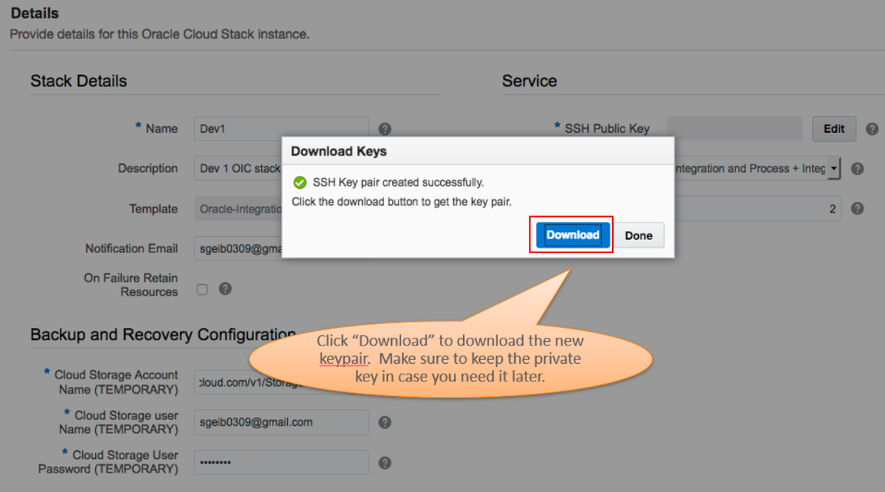
    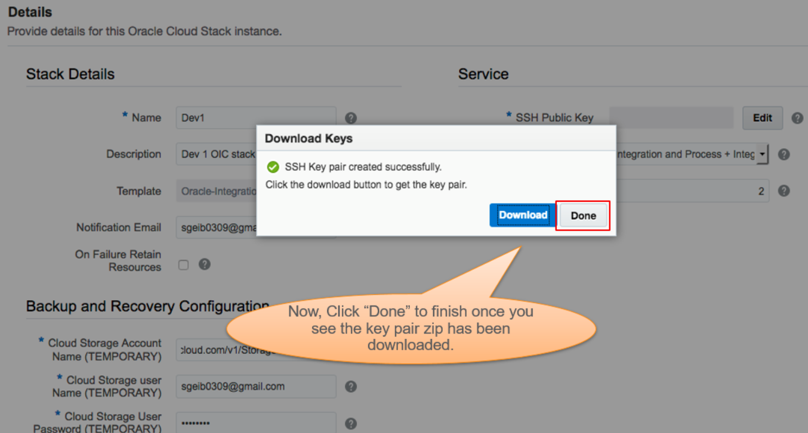

- Make sure all the details are filled and looks good. Click on next. Click on confirm.

    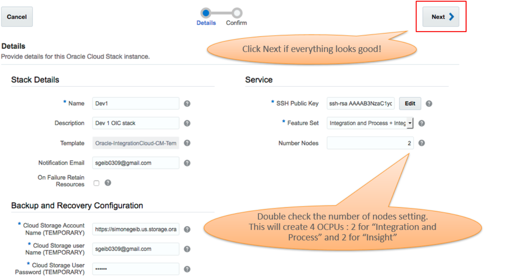
    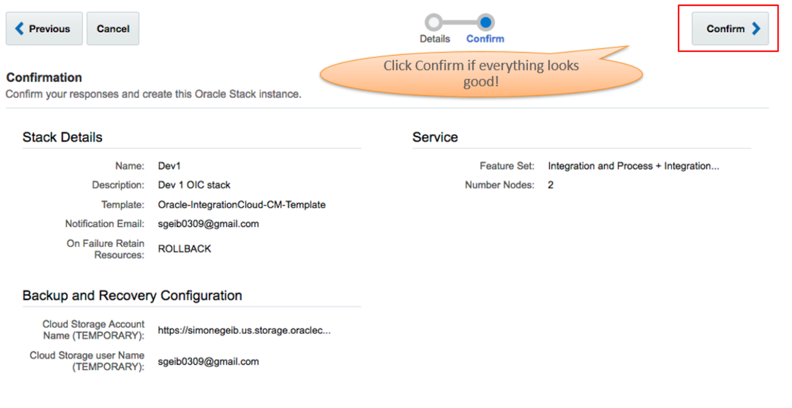

- You will see stack creation log.

    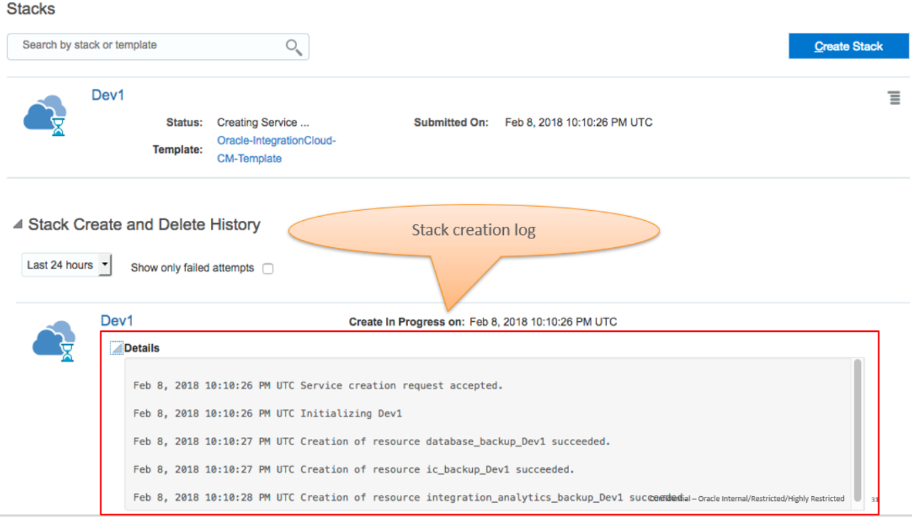

- Give few mins and you will see the stack created.

    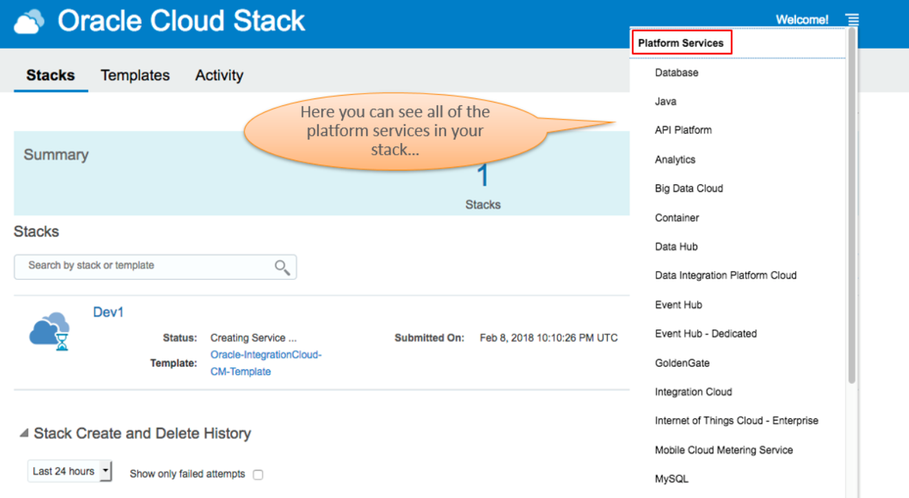
    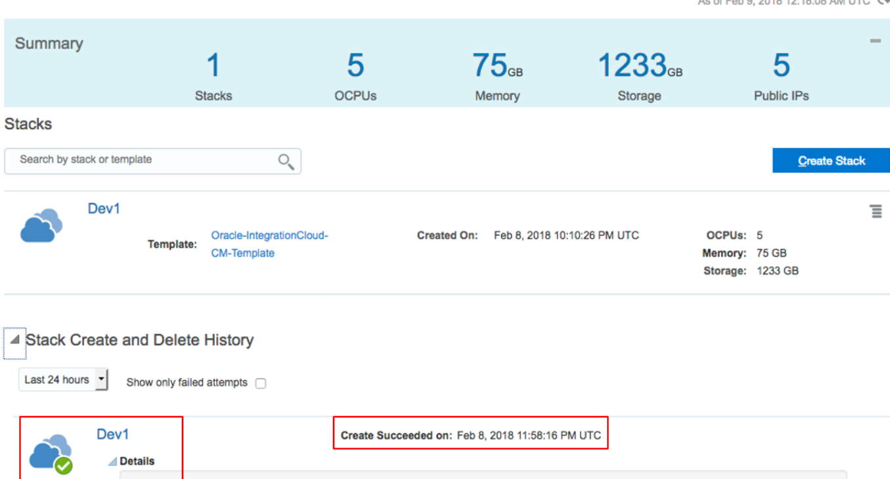 

-  Now, go to Integration Cloud Service.

    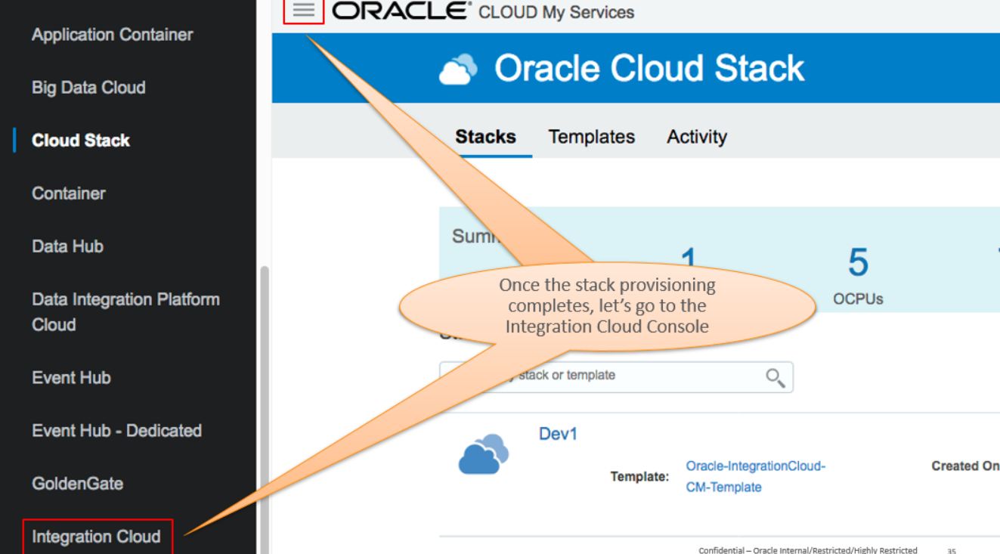

- Click on the instance we created using stack to view details.
    
    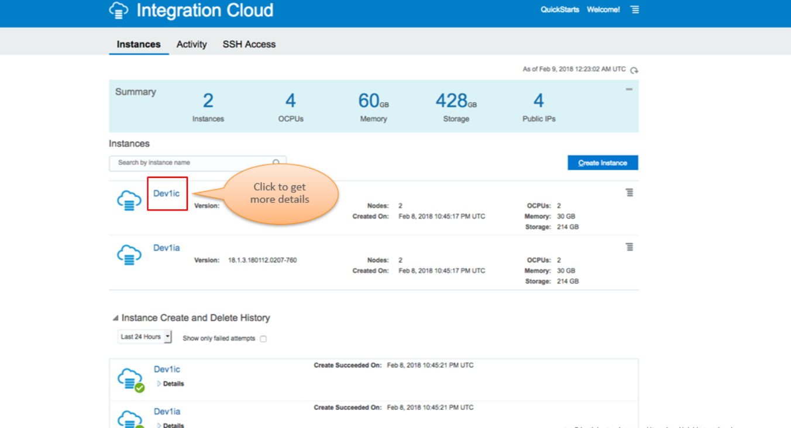

- Go back to OIC console.
    
    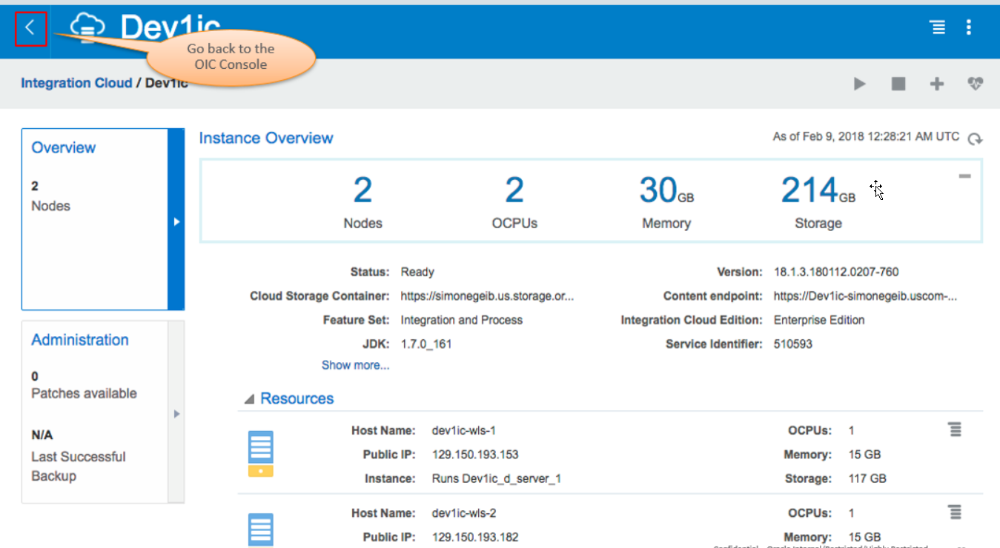

- Now, open the integration cloud console. This should open the Integration cloud page. Click on Home.

    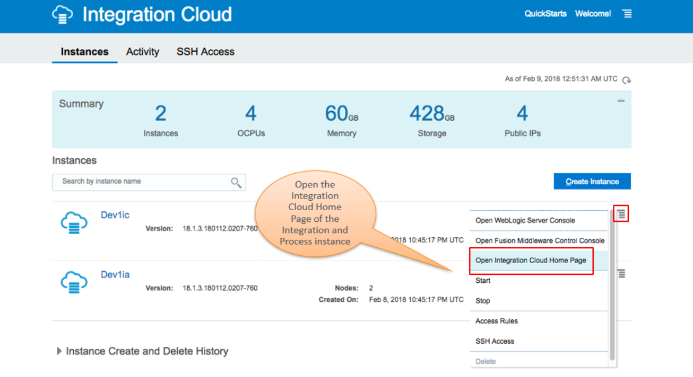
    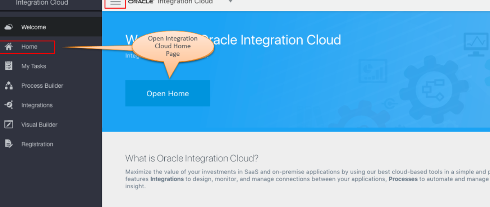

- We will explore the Oracle Integration page in detail in future labs.

# Workshop Objectives

## Lab 100: Explore Oracle Integration Cloud

**Documentation**: [LabGuide100.md](LabGuide100.md)

### Objectives

- Explore Oracle Integration Cloud Service (OIC) to become familiar with it's service console and functionality.

## Lab 200: Creating ICS Connections

**Documentation**: [LabGuide200.md](LabGuide200.md)

### Objectives

- Create your first FTP and ERP connections to later be used in the Integration that will be created in Lab 300.

## Lab 300: Create Integration Flow

**Documentation**: [LabGuide300.md](LabGuide300.md)

### Objectives

- Create your first Integration using the ERP and FTP connections that were previously created in lab 200, before testing them in Lab 400.

## Lab 400: Testing the Integration

**Documentation**: [LabGuide400.md](LabGuide400.md)

### Objectives

- Test the integration built in Lab 300.

## Lab 500:  Ready to go - Integration

**Documentation**: [LabGuide500.md](LabGuide500.md)

### Objectives

- Reuse the built integration to import or export and run and test
