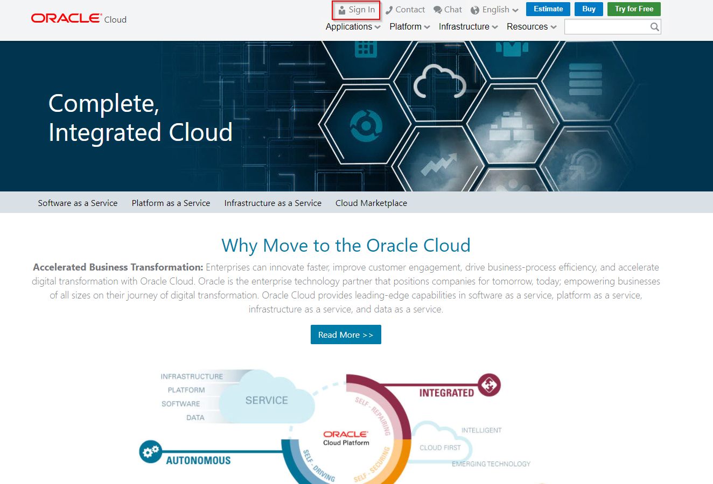

# Lab 100 - Explore Oracle Integration Cloud

Updated: 03-09-18

## Introduction

This is the first of several labs that are part of the **OIC Development** workshop.

In this lab, we will explore the main parts of Oracle Integration Cloud (OIC).  You will acquire a good overview of the Oracle Integration Cloud Service (OIC), the next generation integration platform. You will explore various consoles and tools available to interact with your integration. The exercise will get your familiar with all the tooling available to work with this cloud service. Oracle OIC can function as a central hub for taking in external data feeds, correctly formatting it for ERP Cloud, and automating the final loading of external data into ERP Cloud, With all feeds flowing through OIC, there is greater visibility into the end-to-end data flow between ERP Cloud and external systems. This greatly reduces the integration cost.

We’ll look at the following:
1.	Oracle Cloud Services Dashboard
2.	OIC Designer User Interface
3.	OIC Monitoring User Interface

**To log issues**, click here to go to the [github oracle](https://github.com/oracle/learning-library/issues/new) repository issue submission form.

## Objectives

- Explore Oracle Integration Cloud Service (OIC) to become familiar with it's service console and functionality.

### **STEP 1** Explore the Oracle Cloud Dashboard

- Let’s start by logging into the Oracle Cloud account and explore the Services Dashboard

## Login to your Oracle Cloud account

- From any browser, go to the URL below, or if using a trial account, use the URL emailed to you in your confirmation email:

    `https://cloud.oracle.com`

- click **Sign In** in the upper right hand corner of the browser

    

	**IMPORTANT** - Select 'Cloud Account with Identity Cloud Service' from the dropdown and enter the domain name in the next box below provided by the instructor. Click on Sign In to My Services. If you choose 'Traditional Cloud Account' from the dropdown, select from the drop down list the correct data center and click on **My Services**. If you are unsure of the data center you should select, and this is an in-person training event, ***ask your instructor*** which **Region** to select from the drop down list. If you received your account through an ***Oracle Trial***, you should have recorded the needed information while following the instruction in the [Trial Account Student Guide](StudentGuide.md).
    
    
    

	**NOTE:** the **Identity Domain** values will be given to you from your instructor.

	

- Enter your User Name and Password and click **Sign In** 

  **NOTE:** Both **User Name and Password** values will be given to you by your instructor.

    

- You will be presented with a Dashboard displaying the various cloud services available to this account.
  
	**NOTE:** The Cloud Services dashboard is intended to be used by the *Cloud Administrator* user role.  The Cloud Administrator is responsible for adding users, service instances, and monitoring usage of the Oracle cloud service account.  Developers and Operations roles will go directly to the service console link, not through the service dashboard.

    

- To get to the Integration Cloud Service (OIC) service console where you will work on developing the integration, click on the `hamburger` icon in the _Integration_ section, then click on the `View Details` link.

    

- Select the `Open Service Console` link to go to the OIC instance console page.  

    

- Click on the `hamburger` icon and click on 'Open Integration Cloud Home Page'.

       

- You will now be presented with the OIC Service Console from which you will be performing the rest of this workshop lab.

     

- Click on the Integration tab on left hand side menu. It will open the Integration page that has all the integrations. 

    
    

### **STEP 2** Explore the OIC Designer User Interface

## Explore OIC Connections

- Select the `Connections` graphic in the designer portal

	  

- You can see all the different connections previously made.

	  

- Click on the `Create` button in the upper-right so we can see all the different OIC Connectors that are available.

	

- Scroll through the list of connection types that are available in OIC:

	

- Note that the icons with the plug are those that support the OIC Connectivity Agent for those service types which are not in the cloud, but on-premise, behind the company firewall.

- When you are done browsing, select the “Cancel” button to dismiss the “Select an Adapter” dialog.

### **STEP 3**	Explore OIC Integrations

- Select the `Integrations` menu selection

	

- You can see all the integrations that have been created.

	  

- Open the integration `echo` by clicking on the integration name.  We want to see what it looks like. Since the integration is a sample integration, we’ll be looking at it in `Viewing` mode.

	

- You can see that this orchestration has many steps in it.  The view of the orchestration is *Zoom to Fit* in the browser real estate.  In order to get a closer view of the individual steps, you can either scroll with your mouse wheel to zoom in and out, or you can use the *-/+* slider in the top right of the designer.

- Try zooming in and out by using both methods.  

- If you get zoomed-in too close and want to pan, you’ll be able to move around the orchestration using the Pan window by clicking on the dark area and moving around.

	

- Select the `Start` icon and the drawing gets reset to a zoomed in view with the orchestration trigger at the very top.  This is a nice feature if you don't know where you are in a large orchestration.

	

- Try selecting the `Maximize` viewing control on the very right of the view control bar.  This will hide some of the detail on top of the screen to give the designer the most area to work in.  Hitting the `Maximize` button again will toggle that view.

	

- Let’s look at some of the components of the integration.  Select the `Maximize` view button again to restore the window.

- The component at the very top of the orchestration is the `Trigger`.  The trigger is representative of the connector that’s sending data into the integration.  It is highlighted with a little lightning bolt signifying an incoming event.

- If you hover over the Trigger node, you can see the details.  Our trigger is a REST connector type.  It is called *echoRequest* and we looked at REST connectin before in the Connection section of the OIC Designer.

	

- If you click on the Trigger, a pop-up will appear with a view icon in the shape of an eye.  Select the little eye so we can walk through the wizard that was used to setup the REST trigger.

	

- After the wizard initializes, you’ll be shown the basic information about the trigger – it’s name and description.

	

- Select the `Next` button to see different options assosiated with a REST trigger.

- Finally, a `Summary` tab describes the Trigger’s configuration.

	

- Select the `Close` button to dismiss the Trigger view wizard.

- Similerly you can view other components of the integration by clicking on the view icon in the shape of an eye on each component.

	

- Once you are done exploring the OIC map, select the `Close` button in the upper-right to return back to the OIC orchestration.

- We’ve spent a lot of time exploring the sample 'echo' integration.  Let’s move on and explore the monitoring section.  Select the `Close` button in the upper-right to navigate back to the OIC Integration section.

	

### **STEP 3** Explore the OIC Monitoring User Interface

## Open OIC Monitoring Console

- Select the `back` menu icon on top of the OIC Service Console to go to the `Monitoring` menu.

	

- Next, select the `Monitoring` menu selection to go the OIC monitoring capabilities.

	

- Next, select the `Dashboards` selection to go to the main OIC monitoring dashboard page.

	

## Explore OIC Monitoring Console - Dashboard

- You will be presented with the OIC Monitoring Dashboard.  Observe the various data that is available from this dashboard such as *% of successful messages*, *# of Currently Used Connections*, etc.

	  

- On the right side of the `Dashboard` there are links where you can view the `Activity Stream`, Download the logs, and Download an Incident if a service request needs to be raised.

- Click on the Activity Stream link

	

- You will be directed to the `Integration` screen where you can view a summary of all messages that have passed through OIC in a tabular form.

	

- In the `Activity Stream` you can see the steps in the integration you built and that were executed and whether or not they were successful.

## Explore OIC Monitoring Console - Logfiles

- In order to see the details of the payload that passed through the OIC integration, you need to download the Activity Stream Log from the `Download Logs` link on the right of the Activity Stream.

- Select the `Download Activity Stream` link and then save the zipfile to a location on your workstation such as *C:\temp* (Windows path)

	
	

- A downloading informational message will be shown with a blue background at the top of the page.  You can dismiss it by selecting the "X" at the right of the message bar.

	

- Extract the zipfile and you’ll see that there are 2 directories of logfiles – this is because the OIC instance is running on a cluster of 2 servers for high availability.

	

- Navigate into one of the server directories and examine the `OIC-flow.log` file in your favorite text editor.

- This logfile is helpful for investigation during development or runtime analysis.  The capture of the runtime payloads can be turned on or off during activation of the OIC integration where you are prompted whether or not you want to save the payloads.

## Explore OIC Monitoring Console - Integrations

- Back in the OIC Monitoring console, select `Integrations` from the left-hand navigation.

- Note that all the statistOIC of the integration you built and ran are shown.

	

## Explore OIC Monitoring Console - Tracking

- Select the `Tracking` link in the navigation bar on the left

	

- The OIC `Tracking` monitor page shows all integration flows that have been executed.

- Select the chevron just to the right of the *Tracking* label at the top of the page to change the granularity of the Tracking report to `Last 6 Hours`

	

- Next, drill into a `COMPLETED` integration flow by selecting the integration name.

	

- We can now see that all steps in the this OIC integration flow were successful because the arrow is green highlighting all the orchestration flow steps.

	

- Select the `Close` button to go back to the OIC monitoring page.

	

- We are now done exploring the OIC monitoring features.

- You now have used Oracle Integration Cloud Service to explore an integration to HCM Cloud by taking in external data feeds, correctly formatting it for HCM Cloud.

- This OIC Overview Lab is now completed.
