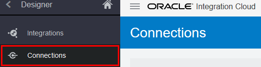
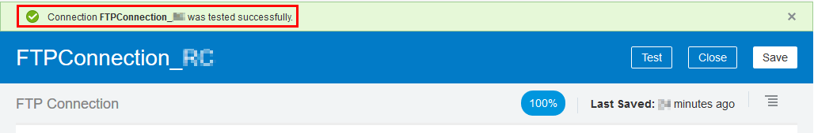
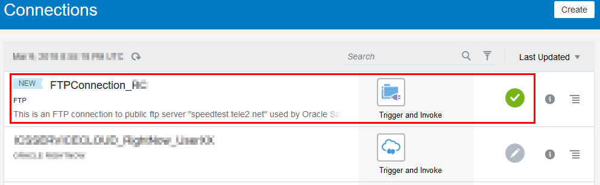

# CSH Campaign Assets 2018: File Transfer with Oracle Integration Cloud

Updated: 09-Mar-2018

## Introduction

This is the second of several labs that are part of the **CSH Campaign Assets 2018: File Transfer with Oracle Integration Cloud**. This workshop will demonstrate how to read an opaque file from a *inbound*  directory and write the file to an *upload* directory in a scheduled orchestrated integration. 

In the first lab (100), we focused on provisioning the Oracle Integration Cloud environment and to  familiarize you with Oracle Integration Cloud. In this lab you will create the connection which allows Integration Cloud to interact with and FTP server.

***To log issues***, click here to go to the [github oracle](https://github.com/oracle/learning-library/issues/new) repository issue submission form.

## Objectives

- Configure the connection properties 
- Test the connection

# Create Connection
Connections allow Integration Cloud to interact with an application instance. A connection is required for every application instance that participates in an integration. In this lab, you will create one connection - for an FTP folder using the FTP adapter. 

  - connectivity by specifying the FTP server URL
  - Configure the security by selecting the Security Policy and credentials

## Create the FTP Connection

### **STEP 1**: Configure the connection properties

- Start **Integration Cloud** and click on **Integrations**.

        

- In the resulting **Integrations** navigation pane, click **Connections**.

        

- In the **Connection** page, click **Create**.

- Type `ftp` in the Select Adapter Search field, click **FTP** in the resulting drop-down, and then select the **FTP** adapter.

        

- Enter the following connection information in the **Create New Connection** dialog.

  - **Name**: `FTPConnection_XX` (where `XX` should be your initials)
  
  - **Identifier**: Auto generated (keep default value)
  
  - **Role**: Trigger and Invoke (keep default value)
  
  - **Description**:  `This is an FTP connection to public ftp server "speedtest.tele2.net" used by Oracle Samples.`
  
  - Click **Create** to complete the connection properties.
  
- In the **Email Address** field of the Connection Administrator section, enter your email address.

- Click **Configure Connectivity** to configure the FTP URL. Enter the following information in the **Connection Properties** dialog (only required fields are shown):

  - **FTP Server Host Address**: `speedtest.tele2.net`
  
  - **FTP Server Port**: `21` 
  
  - Click **OK**.
  
- Next, click **Configure Security** to configure the connection security settings. Enter the following information in the **Credentials** dialog (only required fields are shown):

  - For **Security Policy**, select **FTP Server Access Policy**.
  
  - **User name**: `anonymous`
  
  - **Password**: `<choose any>` (the security level is low as it's a public FTP server)
  
  - Click **OK** to save settings. 
  
- You will notice the connection is not complete at this point. Proceed to the next step to finalize the connection.

### **STEP 2**: Test and complete the connection

- In the top right corner, Click **Test** to verify and complete the connection.

        

  - In the **Test Connection?** dialog, click **Test**. 
  
         
     
- If the test is successful, you see the following message at the top of the window.

    

- Click **Save**, then click **Close**.

The new connection is added to the top of list in the **Connections** page. Validate the _check-mark_ on your connection.
  
    

> If the test is _not successful_, then verify the connection properties. If the problem still persists, then please log an issue (explained in the **Introduction** section).
