# Lab 400 - Testing the Integration

Updated: 13-Mar-2018

## Introduction

This is the forth of several labs that are part of the **ICS-ERP Development** workshop. 

In this lab, you will test the integration that was created in Lab 300 and see how the Integration is replicated into ERP Cloud.

**To log issues**, click here to go to the [github oracle](https://github.com/oracle/learning-library/issues/new) repository issue submission form.

## Objectives

- Test the integration built in Lab 300.

## Required Artifacts

- The following lab and an Oracle Public Cloud account that will be supplied by your instructor.

### **STEP 1** Activating the ICS Integration

- Before we start testing the integration, you need to activate the integration for testing.

- On the Integration page and you should see the integration created in the lab 300. On the right side of the integration click on the 'Hamburger' menu and click on activate. This should activate the integration.

	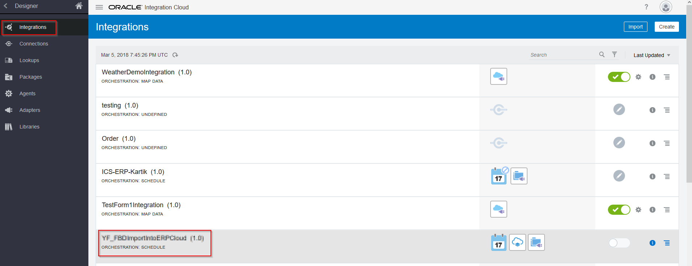
	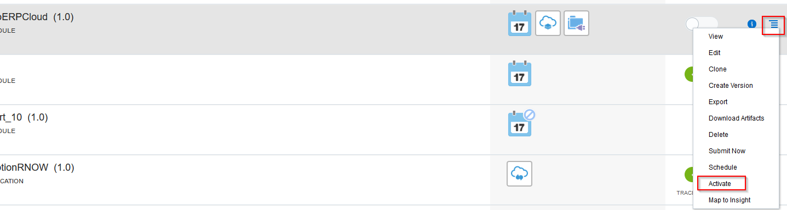

- Make sure to tick "enable tracing" and "include payload" when the window pops up. Click on the activate button to activate it.

	

- When the integration is activated the switch turns to green. A green tab with success message and url endpoint to access it pops up on top. You can close it by clicking on 'X' button.

	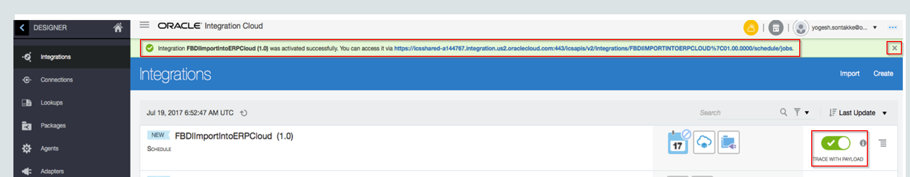

- Next to green switch click on 'i' icon which gives the details about the integration.

	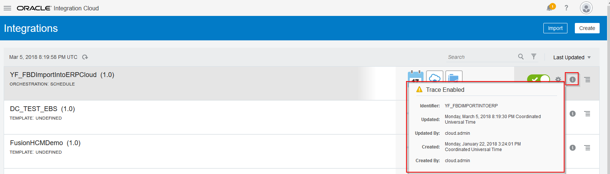

### **STEP 2** Testing the Integration

- On the right side of the integration click on the 'Hamburger' menu and Click on Submit Now option. A green pop up box opens up on the top with request id. 

	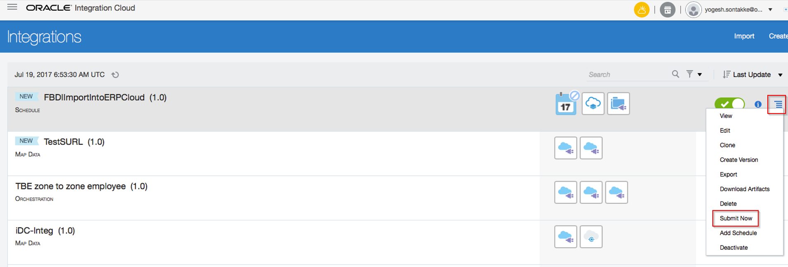
	

- Go to monitoring tab by going back on the designer tab.

	
	

- Click on the runs tab and tracking tab. This shows the integration being run and also shows if the integration is successful or not.

	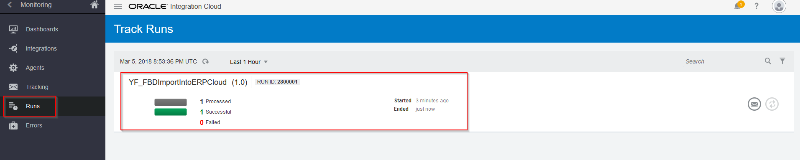
	

- Click on the integrations tab. This shows the success message.

	

- Now, lets check if the data is loaded and imported into ERP Cloud. Login to the ERP Cloud. The login details are given by the lab instructor.

	
	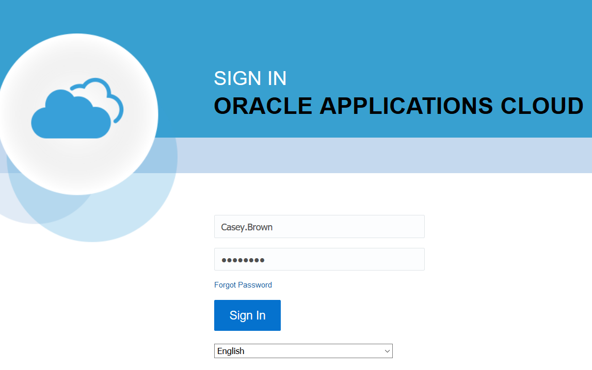

- The login page looks like this. Click on the 'Hamburger' menu at the top and then click on more as shown below. Note: The 'more' option appears only sometimes. If you don't see it, ignore it.

	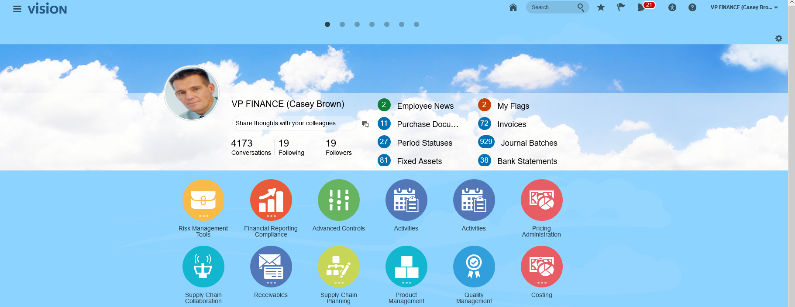
	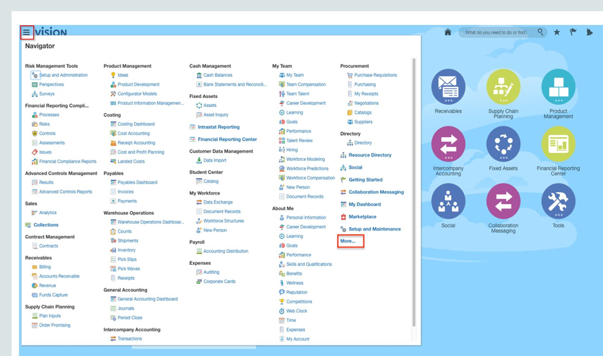

- Under the tools section, click on Scheduled processes.

	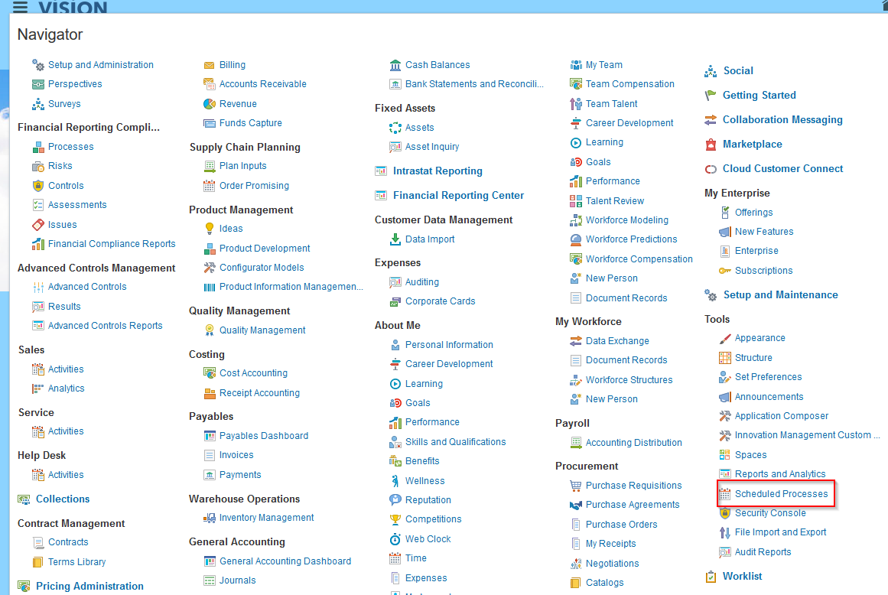

- You can see different steps here. Note that both loading and importing have been successful into ERP tables. You need to go back and verify the steps if you see an error here.

	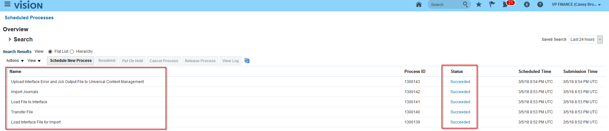

- You have now completed the final lab of the ICS-ERP Developer Workshop.  

- Congratulations! You should now have a much better understanding of how to work with ICS to create complex integrations.
